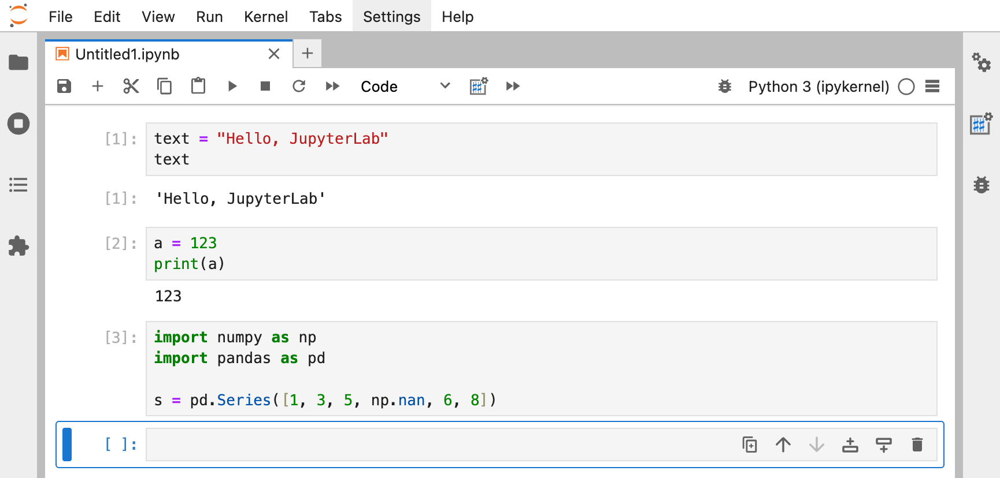
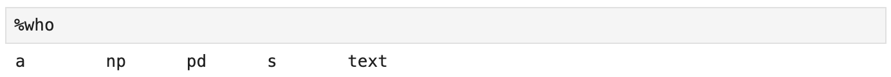
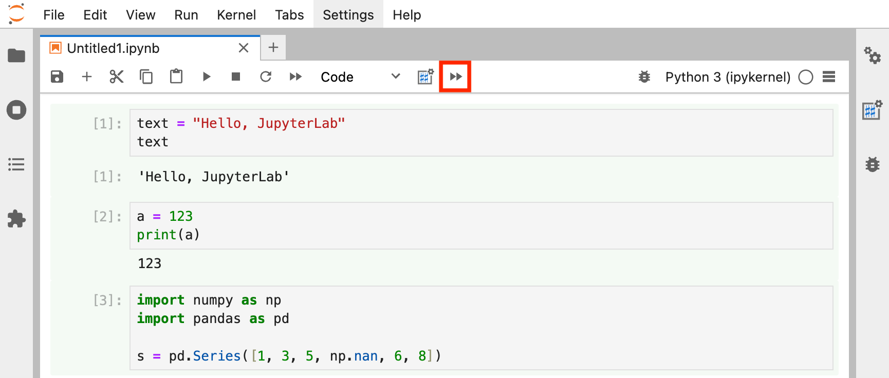
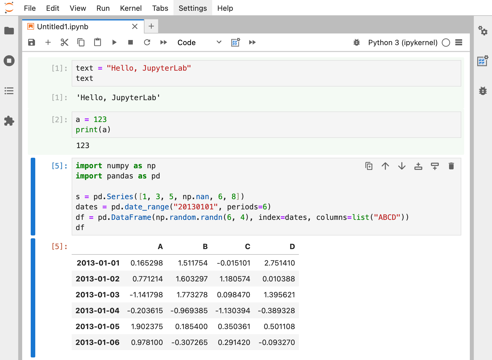
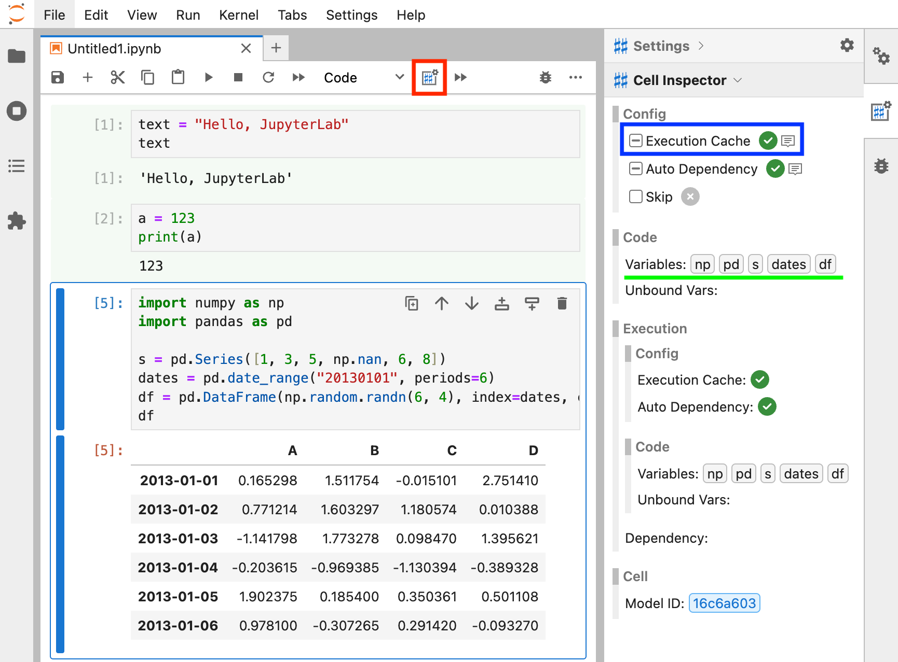

# jupyterlab_double_sharp

[](https://github.com/freeislet/jupyterlab-double-sharp/actions/workflows/build.yml)
[](https://mybinder.org/v2/gh/freeislet/jupyterlab-double-sharp/main?urlpath=lab)

Double-Sharp(##) is a jupyterlab extension that provides features like execution cache, auto-dependency, external file loading(TODO) and more.

## Execution Cache

Skip execution if the variables assigned in the cells (and also the imported modules) already exist in the kernel.

For example, suppose the following code cells are executed.



At this point, the kernel stores the variables `text`, `a`, `np`, `pd`, and `s`. Note that this list of variables is the same as the result of the `%who` magic command.



To run all cells, click the **"## Run all cells"** button on the toolbar, which is red rectangled in the image below, and was added by this extension for ease of execution and keyboard shortcut.



At the time of execution of all cells, if all the variables assigned in the cell and all the imported modules already exist in the kernel, the cell will not be executed. Also, the background color of unexecuted (i.e., cached) cells will be changed to **light green**, as shown above.

> The cache feature is ignored when executing **selected cells**. It is only applied when executing **all cells**, including **cells above** or **below**. This feature can be turned on or off with the **"Ignore Cache for Selected Cells"** option in the Settings panel.

Currently, no cells have been executed because all variables and modules exist in the kernel. However, if you edit the code so that new variables are assigned, the next time you click "## Run all cells", the edited cell will be executed as shown in the image below. (Note that the light green background color has disappeared because the cell was run with the `dates` and `df` variables added)



You can change the behavior of this feature in the **"## Cell Inspector"** provided by the extension. Clicking the **"## Inspector"** button on the toolbar, red rectangled in the image below, will open the Inspector on the right side with the "## Cell Inspector" expanded. You can also set global settings in the Settings panel, which will be covered later.



**"Execution Cache"** option in the blue rectangle allows you to turn the cache feature on, off, or to follow global settings. In the image above, the "Execution Cache" option is set to indeterminate, which means it follows the global setting. The green checkmark after the option means that the cache feature is eventually enabled (because the global setting is set to enable cache).

The Variables list (green underlined in the image above) shows the assigned variables and the imported module names in the cell. (`np`, `pd`, `s`, `dates`, `df`)

## Auto Dependency

TBD

## Skip Execution

TBD

## Cell Inspector

TBD

## Settings

TBD

## Client-Side Magic Command

TBD

### ##%cache [true|false|1|0]

TBD

### ##%skip

TBD

### (TODO) ##%load

## Requirements

- JupyterLab >= 4.0.0

## Install

To install the extension, execute:

```bash
pip install jupyterlab_double_sharp
```

## Uninstall

To remove the extension, execute:

```bash
pip uninstall jupyterlab_double_sharp
```

## Contributing

### Development install

Note: You will need NodeJS to build the extension package.

The `jlpm` command is JupyterLab's pinned version of
[yarn](https://yarnpkg.com/) that is installed with JupyterLab. You may use
`yarn` or `npm` in lieu of `jlpm` below.

```bash
# Clone the repo to your local environment
# Change directory to the jupyterlab_double_sharp directory
# Install package in development mode
pip install -e "."
# Link your development version of the extension with JupyterLab
jupyter labextension develop . --overwrite
# Rebuild extension Typescript source after making changes
jlpm build
```

You can watch the source directory and run JupyterLab at the same time in different terminals to watch for changes in the extension's source and automatically rebuild the extension.

```bash
# Watch the source directory in one terminal, automatically rebuilding when needed
jlpm watch
# Run JupyterLab in another terminal
jupyter lab
```

With the watch command running, every saved change will immediately be built locally and available in your running JupyterLab. Refresh JupyterLab to load the change in your browser (you may need to wait several seconds for the extension to be rebuilt).

By default, the `jlpm build` command generates the source maps for this extension to make it easier to debug using the browser dev tools. To also generate source maps for the JupyterLab core extensions, you can run the following command:

```bash
jupyter lab build --minimize=False
```

### Development uninstall

```bash
pip uninstall jupyterlab_double_sharp
```

In development mode, you will also need to remove the symlink created by `jupyter labextension develop`
command. To find its location, you can run `jupyter labextension list` to figure out where the `labextensions`
folder is located. Then you can remove the symlink named `jupyterlab-double-sharp` within that folder.

### Testing the extension

#### Frontend tests

This extension is using [Jest](https://jestjs.io/) for JavaScript code testing.

To execute them, execute:

```sh
jlpm
jlpm test
```

#### Integration tests

This extension uses [Playwright](https://playwright.dev/docs/intro) for the integration tests (aka user level tests).
More precisely, the JupyterLab helper [Galata](https://github.com/jupyterlab/jupyterlab/tree/master/galata) is used to handle testing the extension in JupyterLab.

More information are provided within the [ui-tests](./ui-tests/README.md) README.

### Packaging the extension

See [RELEASE](RELEASE.md)
